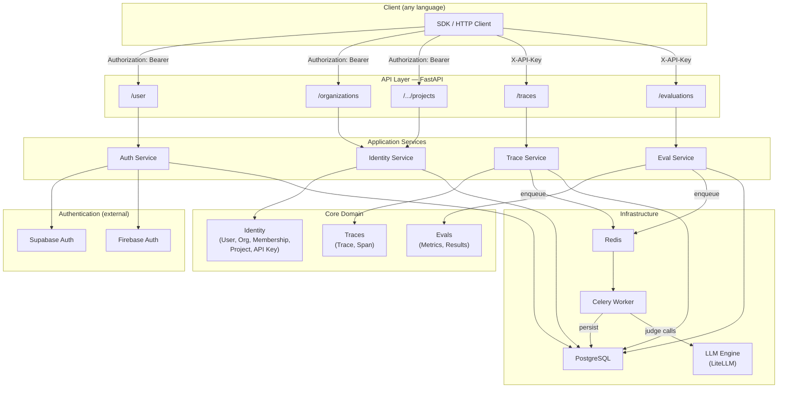

# OpenTracer

Open-source, multi-tenant agent tracing and evaluation service. Trace agentic workflows from any framework, evaluate them with LLM-as-a-judge metrics, and query results via a REST API.

## Quick Start

```bash
# 1. Copy and configure environment
cp .env.example .env.development
# Edit .env.development — add your Supabase credentials and LLM provider keys

# 2. Start services
make up

# 3. API available at http://localhost:8000
#    Swagger docs at http://localhost:8000/docs
```

> [!NOTE]
> **When you have db model changes:**
> 
> - Generate the migration file:
>   ```
>   make migration msg="your message"
>   ```
> - (Optional) Manualy apply migration (entrypoint auto applies on `make up`):
>   ```
>   make migrate
>   ```


## Architecture



## Multi-Tenant Hierarchy

```
User ──(Membership)──> Organization ──> Project ──> Trace / Evaluation
                                            └──> API Key (scoped to project)
```

- **Users** authenticate via an external IdP (Supabase or Firebase) and receive an app JWT.
- **Organizations** contain **Projects**. Users join orgs via **Memberships** (OWNER / ADMIN / MEMBER).
- **API Keys** are scoped to a single project. Traces and evaluations are routed to the correct project automatically from the key.

## Auth Strategy

| Mode | `AUTH_PROVIDER` | Identity Provider | Required Env Vars |
|------|----------------|-------------------|--------------------|
| **Supabase** | `supabase` | Supabase Auth (cloud) | `SUPABASE_URL`, `SUPABASE_KEY` |
| **Firebase** | `firebase` | Firebase Admin SDK | `GOOGLE_CLOUD_PROJECT` |

**Token flow:**
1. User authenticates with the external IdP (Supabase or Firebase) and receives an IdP access token.
2. Management APIs use `Authorization: Bearer <idp_token>`. Users and default organizations are provisioned automatically on first request (JIT).
3. Data APIs (traces, evals) use `X-API-Key: <project_key>`.

## Project Structure

```
app/
├── api/v1/routes/       # FastAPI routers (auth, orgs, projects, traces, evals, health)
├── core/
│   ├── identity/        # User, Org, Membership, Project, API Key entities
│   ├── traces/          # Trace & Span entities + repository
│   └── evals/           # Evaluation entities + metric registry
│       └── metrics/     # BaseMetric, task_completion, ...
├── registry/            # Settings, constants, exceptions, security
├── infrastructure/
│   ├── auth/            # Pluggable auth adapters (Supabase, Firebase, JWT issuer)
│   ├── db/              # SQLAlchemy models + repositories
│   ├── queue/           # Celery app + tasks
│   └── llm/             # Universal LLM engine (LiteLLM)
├── services/            # Orchestration (auth, identity, trace, eval)
└── main.py
```

## Services (Docker Compose)

| Service      | Description                    | Port  |
|--------------|--------------------------------|-------|
| **app**      | FastAPI application server     | 8000  |
| **worker**   | Celery background worker       | —     |
| **postgres** | PostgreSQL 16                  | 5432  |
| **redis**    | Redis 7 (broker + cache)       | 6379  |

## Local Development

```bash
make install     # install deps via uv
make dev         # run app with hot-reload
make worker      # run Celery worker (separate terminal)
make migrate     # apply Alembic migrations
make test        # run test suite
make lint        # ruff linter
make help        # show all commands
```

## Key API Endpoints

| Method | Path | Auth | Description |
|--------|------|------|-------------|
| `GET`  | `/user` | Bearer | Current user profile |
| `POST` | `/organizations` | Bearer | Create an organization |
| `GET`  | `/organizations` | Bearer | List user's organizations |
| `POST` | `/organizations/{id}/members` | Bearer | Invite a user |
| `POST` | `/organizations/{id}/projects` | Bearer | Create a project |
| `GET`  | `/organizations/{id}/projects` | Bearer | List projects |
| `POST` | `/organizations/{id}/api-keys` | Bearer | Generate API key (scoped to project) |
| `POST` | `/traces` | API Key | Ingest a trace (async, 202) |
| `GET`  | `/traces` | API Key | List traces |
| `GET`  | `/traces/{id}` | API Key | Get trace with spans |
| `POST` | `/evaluations` | API Key | Trigger async evaluation |
| `GET`  | `/evaluations/{id}` | API Key | Get evaluation results |
| `GET`  | `/evaluations/metrics` | — | List registered metrics |
| `GET`  | `/evaluations/providers` | — | List available LLM providers |

## Environment Variables

See [`.env.example`](.env.example) for the full list. Key variables:

| Variable | Description |
|----------|-------------|
| `AUTH_PROVIDER` | `supabase` or `firebase` |
| `SUPABASE_URL` | Supabase project URL (Dashboard → Settings → API → Project URL) |
| `SUPABASE_KEY` | Supabase anon/public key (Dashboard → Settings → API → `anon` `public` key) |
| `GOOGLE_CLOUD_PROJECT` | GCP project for Firebase + Vertex AI |
| `EVAL_LLM_MODEL` | Default eval model (LiteLLM format) |
| `OPENAI_API_KEY` | OpenAI credentials |


# Authors

Built by the founder of Chirpz AI. Contact sina@chirpz.ai for all enquiries.

<br />

# License

OpenTracer is licensed under Apache 2.0 - see the [LICENSE.md](https://github.com/chirpz-ai/opentracer/LICENSE) file for details.
