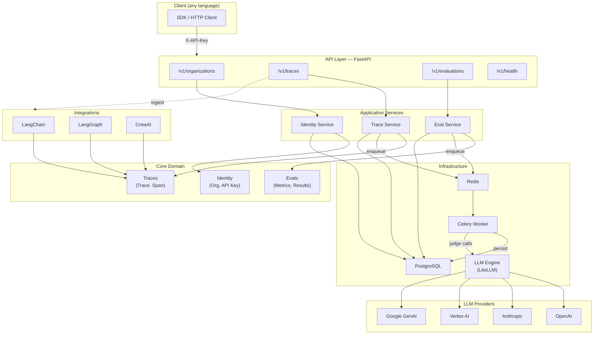

# Opentracer

Open-source, modern and multi-tenant agent tracing and evaluation service. Trace agentic workflows from any framework, evaluate them with novel metrics, and query results via a REST API.

## Quick Start

```bash
# 1. Copy and configure environment
cp .env.example .env.development
# Edit .env.development — add your LLM provider keys

# 2. Start all services
make up

# 3. API available at http://localhost:8000
#    Swagger docs at http://localhost:8000/docs
```

## Architecture



## Project Structure

```
app/
├── api/v1/routes/       # FastAPI routers (health, orgs, traces, evals)
├── core/
│   ├── identity/        # Organization & API Key entities
│   ├── traces/          # Trace & Span entities + repository
│   └── evals/           # Evaluation entities + metric registry
│       └── metrics/     # BaseMetric, task_completion, ...
├── registry/            # Settings, constants, exceptions
├── infrastructure/
│   ├── db/              # SQLAlchemy models + repositories
│   ├── queue/           # Celery app + tasks
│   └── llm/             # Universal LLM engine (LiteLLM)
├── integrations/        # Framework transformers
│   ├── langchain/
│   ├── langgraph/
│   └── crewai/
├── services/            # Orchestration (identity, trace, eval)
└── main.py
```

## Services (Docker Compose)

| Service      | Description                  | Port  |
|--------------|------------------------------|-------|
| **app**      | FastAPI application server   | 8000  |
| **worker**   | Celery background worker     | —     |
| **postgres** | PostgreSQL 16                | 5432  |
| **redis**    | Redis 7 (broker + cache)     | 6379  |

## Local Development

```bash
make install     # install deps via uv
make dev         # run app with hot-reload
make worker      # run Celery worker (separate terminal)
make migrate     # apply Alembic migrations
make test        # run test suite
make lint        # ruff linter
make help        # show all commands
```

## Key API Endpoints

| Method | Path | Description |
|--------|------|-------------|
| `POST` | `/v1/organizations` | Create an organization |
| `POST` | `/v1/organizations/{id}/api-keys` | Generate API key |
| `POST` | `/v1/traces` | Ingest a trace (async, 202) |
| `POST` | `/v1/traces/ingest/{source}` | Ingest framework-specific trace |
| `GET`  | `/v1/traces` | List traces |
| `POST` | `/v1/evaluations` | Trigger async evaluation |
| `GET`  | `/v1/evaluations/{id}` | Get evaluation results |
| `GET`  | `/v1/evaluations/providers` | List available LLM providers |
| `GET`  | `/v1/evaluations/metrics` | List registered metrics |

## LLM Providers

The evaluation engine uses [LiteLLM](https://github.com/BerriAI/litellm) and supports:

- **OpenAI** — `openai/gpt-4o-mini`
- **Anthropic** — `anthropic/claude-3-5-sonnet-20241022`
- **Vertex AI** — `vertex_ai/gemini-2.5-flash` (default)
- **Google GenAI** — `gemini/gemini-2.5-flash`

Set only the keys for the providers you use. The service reports unavailable providers clearly via `GET /v1/evaluations/providers`.

## Environment Variables

See [`.env.example`](.env.example) for the full list. Key variables:

| Variable | Description |
|----------|-------------|
| `OPENAI_API_KEY` | OpenAI credentials |
| `ANTHROPIC_API_KEY` | Anthropic credentials |
| `GOOGLE_CLOUD_PROJECT_ID` | GCP project for Vertex AI |
| `GEMINI_API_KEY` | Google AI Studio key |
| `EVAL_LLM_MODEL` | Default eval model (LiteLLM format) |


# Authors

Built by the founder of Chirpz AI. Contact sina@chirpz.ai for all enquiries.

<br />

# License

OpenTracer is licensed under Apache 2.0 - see the [LICENSE.md](https://github.com/chirpz-ai/opentracer/LICENSE) file for details.