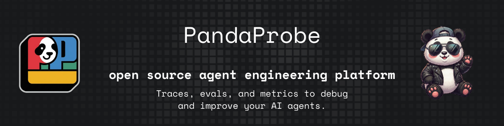
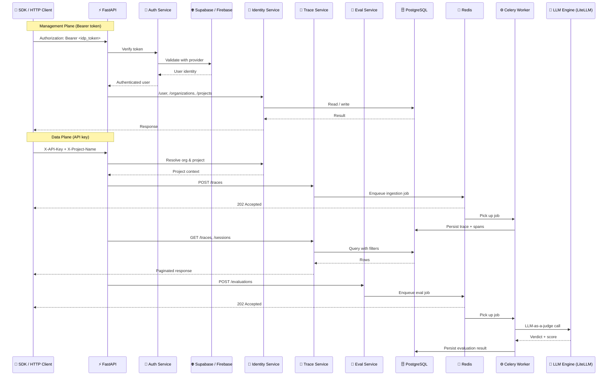

<div align="center">
  <a href="https://pandaprobe.com" target="_blank" rel="noopener noreferrer">
    
  </a>
</div>

<p align="center">
  PandaProbe is an open source agent engineering platform.<br>
  It helps teams collaboratively develop, monitor, evaluate, and debug AI agents.<br>
  You can use PandaProbe cloud (under dev) or self host the service.
</p>

<p align="center">
  <a href="https://pandaprobe.com/" target="_blank"></a>
  <a href="https://pandaprobe.com/" target="_blank"></a>
  <a href="https://x.com/PandaProbe" target="_blank"></a>
</p>

<p align="center">
  <a href="https://github.com/chirpz-ai/pandaprobe/actions/workflows/build.yml"></a>
  <a href="https://github.com/chirpz-ai/pandaprobe/actions/workflows/lint.yml"></a>
  <a href="https://github.com/chirpz-ai/pandaprobe/actions/workflows/test-unit.yml"></a>
  <a href="https://github.com/chirpz-ai/pandaprobe/actions/workflows/test-integration.yml"></a>
  <a href="https://github.com/chirpz-ai/pandaprobe/actions/workflows/codeql.yml"></a>
  <a href="LICENSE"></a>
</p>

---

## Quick Start

```bash
# 1. Configure environment
cp backend/.env.example backend/.env.development
# Edit backend/.env.development — add your Supabase credentials and LLM provider keys

# 2. Start all services
make up

# 3. Open http://localhost:8000/scalar for API references
```

## Architecture



## Auth

| Route group | Auth method | Header |
|---|---|---|
| Management (`/user`, `/organizations`, `/projects`) | IdP token | `Authorization: Bearer <token>` |
| Data plane (`/traces`, `/evaluations`, `/sessions`) | API key | `X-API-Key` + `X-Project-Name` |

## Services

| Service | Description | Port |
|---|---|---|
| **app** | FastAPI application server | 8000 |
| **worker** | Celery background worker | — |
| **postgres** | PostgreSQL 16 | 5432 |
| **redis** | Redis 7 (broker + cache) | 6379 |

## Development

```bash
make install          # Install backend deps via uv
make up               # Start all services (Docker)
make down             # Stop all services
make dev              # Run API locally with hot-reload
make worker           # Run Celery worker locally

make lint             # Ruff linter
make format           # Auto-format code
make migration msg="" # Generate Alembic migration
make migrate          # Apply migrations

make test-unit        # Run unit tests
make test-integration # Run integration tests (spins up test DB)
make test-all         # Run everything
make help             # Show all available commands
```

> [!NOTE]
> **Database migrations** are auto-applied on `make up` via the Docker entrypoint.
> 
> To generate a new migration after model changes:
> ```bash
> make migration msg="describe change"
> ```
> To manually apply migrations:
> ```bash
> make migrate
> ```

## Contributing

We welcome contributions! Please read the [Contributing Guide](CONTRIBUTING.md) for details on how to set up your environment, run tests, and submit pull requests.

## Authors

Built by the [Chirpz AI](https://github.com/chirpz-ai) team. Contact sina@chirpz.ai for enquiries.

## License

PandaProbe is licensed under Apache 2.0 — see [LICENSE](LICENSE) for details.
