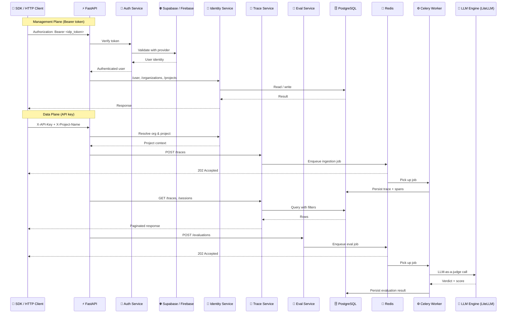

# PandaProbe

Open-source, multi-tenant agent tracing and evaluation service. Trace agentic workflows from any framework, evaluate them with LLM-as-a-judge metrics, and query results via a REST API.

## Quick Start

```bash
# 1. Configure environment
cp backend/.env.example backend/.env.development
# Edit backend/.env.development — add your Supabase credentials and LLM provider keys

# 2. Start all services
make up

# 3. Open http://localhost:8000/scalar for API references
```

## Architecture



## Multi-Tenant Hierarchy

```
User ──(Membership)──► Organization ──► Project ──► Trace / Evaluation
                                   └──► API Key (org-scoped)

Trace ──(session_id)──► Session (implicit grouping, no dedicated table)
```

- **Users** authenticate via an external IdP (Supabase or Firebase).
- **Organizations** contain **Projects**. Users join orgs via **Memberships** (OWNER / ADMIN / MEMBER).
- **API Keys** are org-scoped with `sk_pp_` prefix. The SDK specifies the target project via `X-Project-Name` header. Projects are auto-created on first trace.

## Auth Strategy

| Route group | Auth method | Header |
|---|---|---|
| Management (`/user`, `/organizations`, `/projects`) | IdP token | `Authorization: Bearer <token>` |
| Data plane (`/traces`, `/evaluations`, `/sessions`) | API key | `X-API-Key` + `X-Project-Name` |

## Services

| Service | Description | Port |
|---|---|---|
| **app** | FastAPI application server | 8000 |
| **worker** | Celery background worker | — |
| **postgres** | PostgreSQL 16 | 5432 |
| **redis** | Redis 7 (broker + cache) | 6379 |

## Development

```bash
make install          # Install backend deps via uv
make up               # Start all services (Docker)
make down             # Stop all services
make dev              # Run API locally with hot-reload
make worker           # Run Celery worker locally

make lint             # Ruff linter
make format           # Auto-format code
make migration msg="" # Generate Alembic migration
make migrate          # Apply migrations

make test-unit        # Run unit tests
make test-integration # Run integration tests (spins up test DB)
make test-all         # Run everything
make help             # Show all available commands
```

> [!NOTE]
> **Database migrations** are auto-applied on `make up` via the Docker entrypoint.
> 
> To generate a new migration after model changes:
> ```bash
> make migration msg="describe change"
> ```
> To manually apply migrations:
> ```bash
> make migrate
> ```

## Environment Variables

See [`backend/.env.example`](backend/.env.example) for the full list. Key variables:

| Variable | Description |
|---|---|
| `AUTH_PROVIDER` | `supabase` or `firebase` |
| `SUPABASE_URL` | Supabase project URL |
| `SUPABASE_KEY` | Supabase anon/public key |
| `GOOGLE_CLOUD_PROJECT` | GCP project for Firebase + Vertex AI |
| `EVAL_LLM_MODEL` | Default eval model (LiteLLM format) |
| `OPENAI_API_KEY` | OpenAI credentials |

## Authors

Built by Chirpz AI team. Contact sina@chirpz.ai for all enquiries.

## License

PandaProbe is licensed under Apache 2.0 — see [LICENSE](LICENSE) for details.
