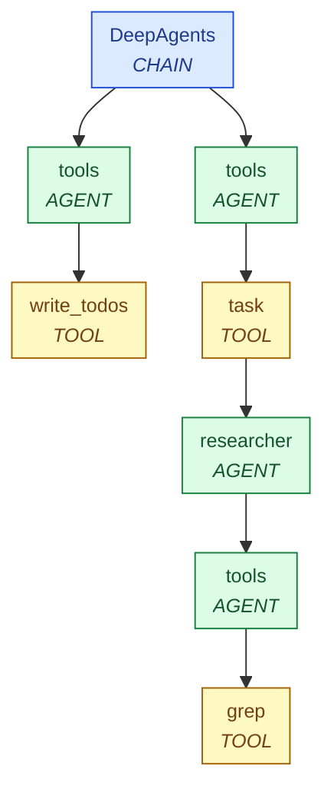

<Note>
  `deepagents` requires Python 3.11 or newer.
</Note>

### Installation

<Tabs>
  <Tab title="pip">
    ```bash
    pip install "pandaprobe[deepagents]"
    ```
  </Tab>
  <Tab title="uv">
    ```bash
    uv add "pandaprobe[deepagents]"
    ```
  </Tab>
</Tabs>

### Setup

```python
from pandaprobe.integrations.deepagents import DeepAgentsCallbackHandler

handler = DeepAgentsCallbackHandler(
    session_id="conversation-123",
    user_id="user-abc",
    tags=["production"],
)
```

<Tip>
  We recommend using UUIDs for `session_id` and `user_id` so traces can be grouped reliably across runs.
</Tip>

### Usage

`create_deep_agent` returns a LangGraph compiled graph that respects LangChain's `config={"callbacks": [...]}`. A single handler instance captures the parent agent **and** every sub-agent dispatched via the built-in `task` tool — sub-agent invocations forward `callbacks` / `tags` / `configurable` through automatically.

```python
from deepagents import create_deep_agent

agent = create_deep_agent(
    model="openai:gpt-5.4-nano",
    tools=[...],
    system_prompt="...",
)

result = agent.invoke(
    {"messages": [{"role": "user", "content": "Hello!"}]},
    config={"callbacks": [handler]},
)
```

<Warning>
  The handler must be passed in `config["callbacks"]` for each invocation. There is no global `instrument()` step.
</Warning>

### What gets traced

| LangChain Callback | Span Kind | Description |
| --- | --- | --- |
| `on_chain_start` / `on_chain_end` | `CHAIN` (root) or `AGENT` (nested) | Root chain creates the trace boundary; LangGraph nodes (`agent`, `tools`, `<middleware>.*`) and sub-agent roots nest as `AGENT` |
| `on_chat_model_start` / `on_llm_end` | `LLM` | Model, parameters, token usage, reasoning |
| `on_tool_start` / `on_tool_end` | `TOOL` | Built-in tools (`write_todos`, `ls`, `read_file`, `write_file`, `edit_file`, `glob`, `grep`, `task`) and your custom tools |

### Sub-agent span tree

DeepAgents' built-in `task` tool synchronously dispatches a declared sub-agent inside its tool body. The resulting trace tree reflects this faithfully — color-coded by `SpanKind` below:



The `task` tool is recorded as `TOOL` (faithful to the LLM's view: `task` is a tool call) with the sub-agent's root chain nested inside as an `AGENT`. This makes "tool dispatched a sub-agent" obvious in the trace tree — note the `task` TOOL node leads directly into the sub-agent's AGENT subtree — without breaking the universal schema.

### Trace name remapping

DeepAgents wraps a LangGraph compiled graph, so the root run reports `name="LangGraph"`. The handler rewrites this to `"DeepAgents"` for the trace name. Custom user-given graph names are preserved.

### Token usage

Token usage is extracted from LangChain's `usage_metadata` (primary) or legacy `llm_output.token_usage` (fallback). The mapping is: `input_tokens` → `prompt_tokens`, `output_tokens` → `completion_tokens`. Reasoning tokens are subtracted from `output_tokens` when present.

### Example with sub-agents

This example declares a `researcher` sub-agent alongside the main deep agent. When the model decides to delegate research, it calls the built-in `task` tool, which dispatches the sub-agent — the handler captures the entire nested run as one trace:

```python
from deepagents import create_deep_agent
from langchain.tools import tool

import pandaprobe
from pandaprobe.integrations.deepagents import DeepAgentsCallbackHandler


@tool
def search_papers(topic: str) -> str:
    """Return a short list of recent papers on a topic."""
    return (
        f"Top 3 recent papers on {topic}:\n"
        "1. Smith et al., 2024 — A survey of advances\n"
        "2. Lee & Kumar, 2024 — Empirical comparisons\n"
        "3. Garcia, 2023 — Foundations and theory"
    )


researcher_subagent = {
    "name": "researcher",
    "description": (
        "Searches for and summarizes recent academic papers on a given topic. "
        "Use this when the user asks for a literature overview."
    ),
    "system_prompt": (
        "You are a research assistant. When given a topic, call search_papers, "
        "then return a concise 2-sentence summary of what you found."
    ),
    "tools": [search_papers],
    "model": "openai:gpt-5.4-nano",
}


agent = create_deep_agent(
    model="openai:gpt-5.4-nano",
    tools=[],
    system_prompt=(
        "You are a senior research lead. For any literature/research request, "
        "delegate to the 'researcher' sub-agent via the task tool, then "
        "synthesize the result into a final answer."
    ),
    subagents=[researcher_subagent],
)


handler = DeepAgentsCallbackHandler(tags=["research-agent", "subagents"])

result = agent.invoke(
    {
        "messages": [
            {
                "role": "user",
                "content": "Give me a brief summary of recent research on retrieval-augmented generation.",
            }
        ]
    },
    config={"callbacks": [handler]},
)

final_message = result["messages"][-1]
print(f"Agent: {final_message.content}")

pandaprobe.flush()
pandaprobe.shutdown()
```

This produces one trace where the parent agent's `task` tool span contains the entire nested `researcher` sub-agent run, including its internal `tools` chain and tool calls.
